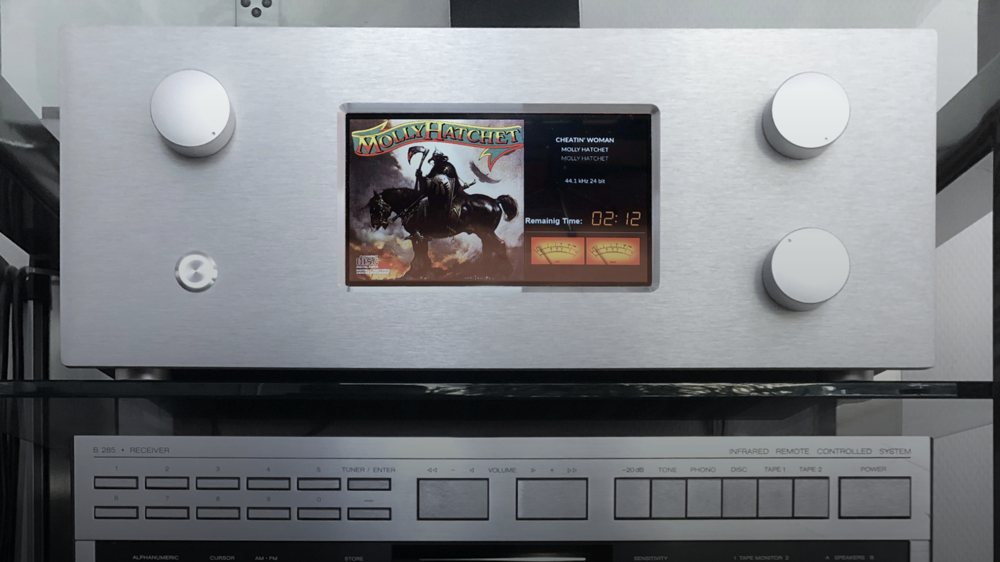

Maker Media GmbH

***

# Volumio mit Drehgebern erweitern

### Die Musik-Distribution Volumio lässt sich leicht über diverse Schnittstellen bedienen – auch stilecht mit Drehknöpfen. In der Make 3/24 zeigen wir, wie man dafür KY-040-Drehgeber in das System einbindet und wie man sie für ein reibungsloses Bedienerlebnis entprellt.

Hier gibt es den Schaltpläne und die Grafik der Platine als Download.

Den vollständigen Artikel kann man in der **[Make-Ausgabe 3/24 (ab S. 118)](https://www.heise.de/select/make)** lesen.
